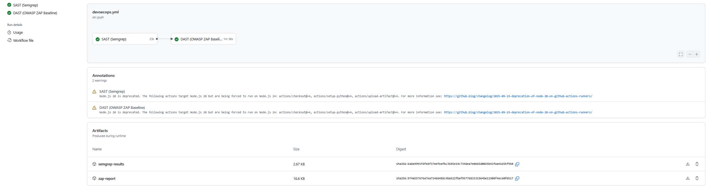

# Automated DevSecOps CI/CD Security Pipeline & Threat Model


## Overview



This repository demonstrates an enterprise-grade **DevSecOps pipeline** built using **GitHub Actions**, integrating automated **Static Application Security Testing (SAST)** with **Semgrep** and **Dynamic Application Security Testing (DAST)** with **OWASP ZAP**. 

The pipeline automatically scans a Python/Flask target application on every push and pull request, identifying security risks early in the Software Development Life Cycle (SDLC) while outputting downloadable vulnerability reports as build artifacts.

---

## Key Features & Security Controls

* **Automated SAST Analysis**: Scans application source code using **Semgrep** rulesets to detect injection risks, insecure template rendering, and unvalidated inputs.
* **Automated DAST Analysis**: Spins up the target application in a containerized runner environment and executes an active baseline vulnerability scan using **OWASP ZAP**.
* **Threat Modeling**: Features a detailed **STRIDE** risk assessment and **Data Flow Diagram (DFD)** documenting attack surfaces and remediation strategies.
* **Artifact Archiving**: Exports structured `semgrep-results.json` and interactive `zap_report.html` execution logs for security team triage.

---

## Technical Stack

* **Language/Framework**: Python 3.10 / Flask
* **CI/CD Platform**: GitHub Actions
* **Static Scanner (SAST)**: Semgrep Engine (`semgrep/semgrep-action`)
* **Dynamic Scanner (DAST)**: OWASP ZAP Baseline Scanner (`ghcr.io/zaproxy/zaproxy`)
* **Threat Modeling Framework**: STRIDE & Data Flow Analysis

---

## Pipeline Workflow Structure

```
.github/
└── workflows/
└── devsecops.yml        # CI/CD Security Pipeline Configuration
app.py                       # Target Web Application
threat-model/
└── DFD_and_Threat_Model.md  # STRIDE Analysis & Architecture DFD
README.md                    # Project Documentation
```

### GitHub Actions Pipeline Flow

```
[ Push / PR Event ]
│
├─────────> [ Job 1: SAST (Semgrep) ] ──> Upload semgrep-results.json
│
└─────────> [ Job 2: DAST (OWASP ZAP) ] ──> Start Flask App ──> Run ZAP Scan ──> Upload zap_report.html
```

---

## Security Findings & Remediation Summary

| Vulnerability Type | Detection Mechanism | Affected Component | Remediation Strategy |
| :--- | :--- | :--- | :--- |
| **Reflected XSS** | Semgrep / OWASP ZAP | `/search` endpoint (`app.py`) | Use Jinja2 auto-escaped templates (`render_template`) instead of direct string rendering. |
| **Missing Security Headers** | OWASP ZAP | HTTP Server Response | Implement `Content-Security-Policy`, `X-Frame-Options`, and `X-Content-Type-Options` headers. |

---

## How to Run Locally

### 1. Run the Flask Web Application

```
bash
python3 -m venv venv
source venv/bin/activate
pip install flask
python app.py
```

### 2. Run Semgrep SAST Locally

```
pip install semgrep
semgrep scan --config auto
```

### 3. Run OWASP ZAP DAST via Docker
```
docker run --net=host -v $(pwd):/zap/wrk/:rw ghcr.io/zaproxy/zaproxy:stable zap-baseline.py \
  -t http://localhost:5000/search?q=test \
  -r zap_report.html
```
